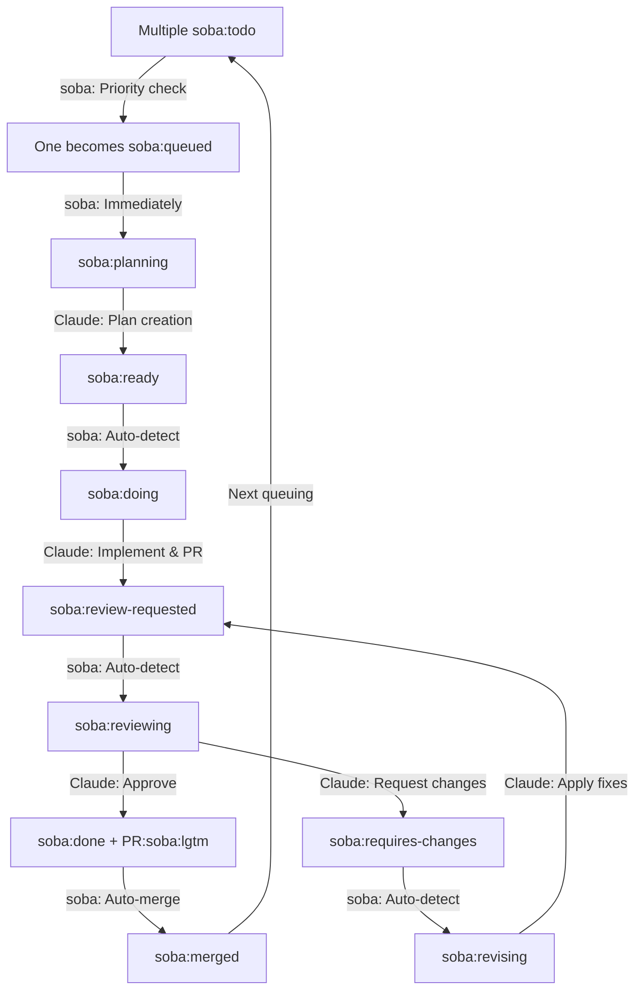

# soba CLI

[](https://github.com/douhashi/soba-cli/releases)
[](https://opensource.org/licenses/MIT)
[](https://www.ruby-lang.org/)

[日本語版はこちら](README_ja.md)

Autonomous GitHub Issue workflow automation CLI that bridges GitHub Issues with Claude Code, enabling AI-driven development cycles.

## Overview

soba CLI automates the entire development workflow from issue creation to pull request merging. It monitors GitHub Issues, automatically processes them through planning, implementation, review, and merge phases using Claude Code AI assistance.

## Key Features

- 🤖 **Autonomous Workflow**: Fully automated issue-to-merge pipeline
- 🏷️ **Label-Driven State Management**: Progress tracking via GitHub labels
- 🔄 **Continuous Processing**: Automatic polling and phase transitions
- 🎯 **Priority Management**: Sequential processing by issue number
- 🪟 **Tmux Integration**: Visual monitoring of AI processes
- 🔀 **Git Worktree Support**: Isolated branch management
- 🚀 **Auto-Merge**: Automatic PR merging after approval

## Workflow



## Installation

### As a Ruby Gem

```bash
gem install soba-cli
```

### From Source

```bash
# Clone the repository
git clone https://github.com/douhashi/soba-cli.git
cd soba-cli

# Install dependencies
bundle install

# Run from source
bin/soba --help
```

## Quick Start

### ⚠ Important Notice ⚠

soba uses `--dangerously-skip-permissions` by default to support AI-driven autonomous development. (This can be disabled in the configuration file)

When using default settings, please take necessary precautions such as using devcontainers and restricting external access.

---

1. **Initialize configuration**
   ```bash
   soba init
   ```

2. **Configure settings**
   Edit `.soba/config.yml`:
   ```yaml
   github:
     # Use gh command authentication (if available)
     auth_method: gh
     # Or use environment variable
     # auth_method: env
     # token: ${GITHUB_TOKEN}
     repository: owner/repo
   ```

3. **Start automation**
   ```bash
   soba start
   ```

4. **Create an issue with label**
   Add `soba:todo` label to any GitHub issue to start automated processing.

## Configuration

Configuration file location: `.soba/config.yml` (in project root)

### GitHub Authentication

soba supports multiple authentication methods:

1. **GitHub CLI (gh command)** - Recommended
   - Uses existing `gh` authentication
   - No need to manage tokens in config files
   - Set `auth_method: gh` in config

2. **Environment Variable**
   - Uses `GITHUB_TOKEN` environment variable
   - Set `auth_method: env` in config

3. **Auto-detect** (Default)
   - Automatically tries `gh` command first
   - Falls back to environment variable if `gh` is not available
   - Omit `auth_method` field for auto-detection

### Full Configuration Example

```yaml
# GitHub settings
github:
  # Authentication method: 'gh', 'env', or omit for auto-detect
  # Use 'gh' to use GitHub CLI authentication (gh auth token)
  # Use 'env' to use environment variable
  auth_method: gh  # or 'env', or omit for auto-detect

  # Personal Access Token (required when auth_method is 'env' or omitted)
  # Can use environment variable
  # token: ${GITHUB_TOKEN}

  # Target repository (format: owner/repo)
  repository: douhashi/soba-cli

# Workflow settings
workflow:
  # Issue polling interval in seconds (default: 20)
  interval: 20
  # Use tmux for Claude execution (default: true)
  use_tmux: true
  # Enable automatic PR merging (default: true)
  auto_merge_enabled: true
  # Clean up tmux windows for closed issues (default: true)
  closed_issue_cleanup_enabled: true
  # Cleanup interval in seconds (default: 300)
  closed_issue_cleanup_interval: 300
  # Command delay for tmux panes in seconds (default: 3)
  tmux_command_delay: 3

# Slack notifications
slack:
  # Webhook URL for Slack notifications
  # Get your webhook URL from: https://api.slack.com/messaging/webhooks
  webhook_url: ${SLACK_WEBHOOK_URL}
  # Enable notifications for phase starts (default: false)
  notifications_enabled: false

# Git settings
git:
  # Base path for git worktrees
  worktree_base_path: .git/soba/worktrees
  # Auto-setup workspace on phase start (default: true)
  setup_workspace: true

# Phase commands (optional - for custom Claude commands)
phase:
  plan:
    command: claude
    options:
      - --dangerously-skip-permissions
    parameter: '/soba:plan {{issue-number}}'
  implement:
    command: claude
    options:
      - --dangerously-skip-permissions
    parameter: '/soba:implement {{issue-number}}'
  review:
    command: claude
    options:
      - --dangerously-skip-permissions
    parameter: '/soba:review {{issue-number}}'
  revise:
    command: claude
    options:
      - --dangerously-skip-permissions
    parameter: '/soba:revise {{issue-number}}'
```

### Environment Variables

| Variable | Description | Required |
|----------|-------------|----------|
| `GITHUB_TOKEN` | GitHub Personal Access Token with repo/read:org/write:discussion scopes | Yes |
| `SLACK_WEBHOOK_URL` | Slack Webhook URL | No |

### Claude Command Templates

Soba automatically deploys Claude command templates to `.claude/commands/soba/` during initialization. These templates define the workflow automation commands for each phase:


- **plan.md** - Issue planning phase template
- **implement.md** - Implementation phase template
- **review.md** - PR review phase template
- **revise.md** - Revision phase template

These templates are included in the gem package and can be found in:
[lib/soba/templates/claude_commands/](lib/soba/templates/claude_commands/)

## Commands

### `soba init`
Initialize soba configuration in the current project.

```bash
# Basic initialization
soba init

# Interactive mode
soba init --interactive
```

### `soba start`
Start the workflow automation daemon.

```bash
# Start in daemon mode (background)
soba start

# Start in daemon mode
soba start --daemon

# Start with specific issue
soba start 123

# Start without tmux
soba start --no-tmux
```

### `soba status`
Show daemon status and recent logs.

```bash
# Basic status
soba status

# Show more log lines
soba status --log 50

# Output as JSON
soba status --json
```

### `soba stop`
Stop the running daemon.

```bash
# Graceful stop
soba stop

# Force stop immediately
soba stop --force

# Custom timeout
soba stop --timeout 60
```

### `soba open`
Open or list tmux sessions for tasks.

```bash
# Open tmux session
soba open

# List all active sessions
soba open --list
```

### `soba config`
Display current configuration.

```bash
# Show configuration
soba config

# Use specific config file
soba --config /path/to/config.yml config
```

## Label System

### Issue Labels (State Management)

| Label | State | Description |
|-------|-------|-------------|
| `soba:todo` | Waiting | New issue awaiting processing |
| `soba:queued` | Queued | Selected for processing |
| `soba:planning` | Planning | Claude creating implementation plan |
| `soba:ready` | Ready | Plan complete, awaiting implementation |
| `soba:doing` | Implementing | Claude working on implementation |
| `soba:review-requested` | Review Pending | PR created, awaiting review |
| `soba:reviewing` | Reviewing | Claude reviewing PR |
| `soba:done` | Complete | Review approved, ready to merge |
| `soba:requires-changes` | Changes Needed | Review requested modifications |
| `soba:revising` | Revising | Claude applying requested changes |
| `soba:merged` | Merged | PR merged and issue closed |

### PR Labels

| Label | Description |
|-------|-------------|
| `soba:lgtm` | Review approved, eligible for auto-merge |

## Development

### Directory Structure

```
lib/
├── soba/
│   ├── cli/              # CLI framework setup
│   ├── commands/         # Command implementations
│   ├── domain/           # Domain models
│   ├── services/         # Business logic
│   └── infrastructure/   # External integrations
```

### Running Tests

```bash
# Run all tests
bundle exec rspec

# Run with coverage
bundle exec rake coverage

# Run specific test suite
bundle exec rspec spec/unit/
```

### Code Quality

```bash
# Run Rubocop (Airbnb style)
bundle exec rubocop

# Auto-fix violations
bundle exec rubocop -a

# Security audit
bundle exec bundler-audit
```

### Git Hooks

The project uses pre-commit hooks for code quality:
- Automatic Rubocop fixes
- Re-staging after auto-fixes
- Block commits with manual fix requirements

Setup hooks:
```bash
./scripts/setup-hooks.sh
```

## Requirements

- Ruby >= 3.0
- Git
- tmux (optional, but recommended)
- GitHub Personal Access Token
- Claude Code CLI (`claude` command)

## Architecture

soba CLI follows a layered architecture:
- **Commands Layer**: CLI command definitions and parsing
- **Domain Layer**: Core business models and logic
- **Services Layer**: Workflow orchestration and state management
- **Infrastructure Layer**: GitHub API and external tool integration

For detailed architecture documentation, see [docs/development/architecture.md](docs/development/architecture.md).

## Contributing

1. Fork the repository
2. Create a feature branch (`git checkout -b feature/amazing-feature`)
3. Commit changes (`git commit -m 'Add amazing feature'`)
4. Push to branch (`git push origin feature/amazing-feature`)
5. Open a Pull Request

Please ensure:
- All tests pass (`bundle exec rspec`)
- Rubocop checks pass (`bundle exec rubocop`)
- Code coverage remains high

## License

This project is licensed under the MIT License - see the [LICENSE](LICENSE) file for details.

## Support

- **Issues**: [GitHub Issues](https://github.com/douhashi/soba-cli/issues)
- **Discussions**: [GitHub Discussions](https://github.com/douhashi/soba-cli/discussions)

## Acknowledgments

- Powered by [Claude Code](https://claude.ai/code) for AI-driven development
- Built with [GLI](https://github.com/davetron5000/gli) for CLI framework
- Styled with [Airbnb Ruby Style Guide](https://github.com/airbnb/ruby)