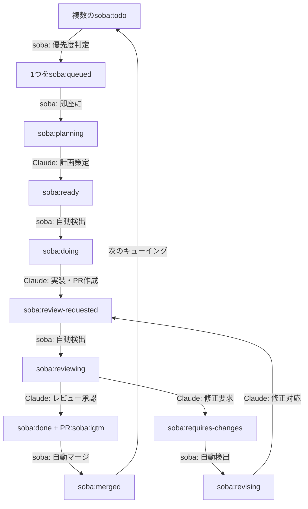

# soba CLI

[](https://github.com/douhashi/soba-cli/releases)
[](https://opensource.org/licenses/MIT)
[](https://www.ruby-lang.org/)

[English version](README.md)

GitHub IssueとClaude Codeを連携させる自律的ワークフロー実行CLIツール。AI駆動の開発サイクルを実現します。

## 概要

soba CLIは、Issueの作成からプルリクエストのマージまで、開発ワークフロー全体を自動化します。GitHub Issueを監視し、Claude Code AIの支援により計画、実装、レビュー、マージの各フェーズを自動的に処理します。

## 主な機能

- 🤖 **自律ワークフロー**: Issue作成からマージまで完全自動化
- 🏷️ **ラベル駆動の状態管理**: GitHubラベルによる進捗追跡
- 🔄 **継続的処理**: 自動ポーリングとフェーズ遷移
- 🎯 **優先順位管理**: Issue番号による順次処理
- 🪟 **Tmux統合**: AIプロセスの可視化監視
- 🔀 **Git Worktreeサポート**: 独立したブランチ管理
- 🚀 **自動マージ**: 承認後の自動PRマージ

## ワークフロー



## インストール

### Ruby Gemとして

```bash
gem install soba-cli
```

### ソースから

```bash
# リポジトリのクローン
git clone https://github.com/douhashi/soba-cli.git
cd soba-cli

# 依存関係のインストール
bundle install

# ソースから実行
bin/soba --help
```

## クイックスタート

### ⚠ 重要な注意 ⚠

soba はAIによる自律的な開発を支援するため、デフォルトの設定で `--dangerously-skip-permissions` を使用します。(設定ファイルで無効化することができます)

デフォルト設定で利用する場合、devcontainerの利用や外部アクセスの制限など、可能な限りの保全作業を行ったうえで使用してください。

---

1. **設定の初期化**
   ```bash
   soba init
   ```

2. **設定ファイルの編集**
   `.soba/config.yml`を編集:
   ```yaml
   github:
     # ghコマンド認証を使用（利用可能な場合）
     auth_method: gh
     # または環境変数を使用
     # auth_method: env
     # token: ${GITHUB_TOKEN}
     repository: owner/repo
   ```

3. **自動化の開始**
   ```bash
   soba start
   ```

4. **ラベル付きIssueの作成**
   GitHub Issueに`soba:todo`ラベルを付けて自動処理を開始。

## 設定

設定ファイルの場所: `.soba/config.yml`（プロジェクトルート）

### GitHub認証

sobaは複数の認証方法をサポートしています：

1. **GitHub CLI (ghコマンド)** - 推奨
   - 既存の`gh`認証を利用
   - 設定ファイルでトークンを管理する必要がない
   - 設定で`auth_method: gh`を指定

2. **環境変数**
   - `GITHUB_TOKEN`環境変数を利用
   - 設定で`auth_method: env`を指定

3. **自動検出** (デフォルト)
   - 最初に`gh`コマンドを試行
   - `gh`が利用できない場合は環境変数にフォールバック
   - 自動検出には`auth_method`フィールドを省略

### 完全な設定例

```yaml
# GitHub設定
github:
  # 認証方法: 'gh'、'env'、または省略して自動検出
  # 'gh'を使用してGitHub CLI認証を利用（gh auth token）
  # 'env'を使用して環境変数を利用
  auth_method: gh  # または'env'、省略で自動検出

  # Personal Access Token（auth_methodが'env'または省略時に必要）
  # 環境変数を使用可能
  # token: ${GITHUB_TOKEN}

  # ターゲットリポジトリ（形式: owner/repo）
  repository: douhashi/soba-cli

# ワークフロー設定
workflow:
  # Issueポーリング間隔（秒）（デフォルト: 20）
  interval: 20
  # Claude実行にtmuxを使用（デフォルト: true）
  use_tmux: true
  # 自動PRマージ有効化（デフォルト: true）
  auto_merge_enabled: true
  # クローズ済みIssueのtmuxウィンドウクリーンアップ（デフォルト: true）
  closed_issue_cleanup_enabled: true
  # クリーンアップ間隔（秒）（デフォルト: 300）
  closed_issue_cleanup_interval: 300
  # tmuxペインへのコマンド遅延（秒）（デフォルト: 3）
  tmux_command_delay: 3

# Slack通知設定
slack:
  # Slack通知用のWebhook URL
  # Webhook URLの取得方法: https://api.slack.com/messaging/webhooks
  webhook_url: ${SLACK_WEBHOOK_URL}
  # フェーズ開始時の通知を有効化（デフォルト: false）
  notifications_enabled: false

# Git設定
git:
  # git worktreeのベースパス
  worktree_base_path: .git/soba/worktrees
  # フェーズ開始時の自動ワークスペース設定（デフォルト: true）
  setup_workspace: true

# フェーズコマンド（オプション - カスタムClaudeコマンド用）
phase:
  plan:
    command: claude
    options:
      - --dangerously-skip-permissions
    parameter: '/soba:plan {{issue-number}}'
  implement:
    command: claude
    options:
      - --dangerously-skip-permissions
    parameter: '/soba:implement {{issue-number}}'
  review:
    command: claude
    options:
      - --dangerously-skip-permissions
    parameter: '/soba:review {{issue-number}}'
  revise:
    command: claude
    options:
      - --dangerously-skip-permissions
    parameter: '/soba:revise {{issue-number}}'
```

### 環境変数

| 変数名 | 説明 | 必須 |
|--------|------|------|
| `GITHUB_TOKEN` | repo/read:org/write:discussion スコープを持つGitHub Personal Access Token | はい |
| `SLACK_WEBHOOK_URL` | SlackのWebhookURL | いいえ |

### Claudeコマンドテンプレート

Sobaは初期化時に自動的にClaudeコマンドテンプレートを `.claude/commands/soba/` に展開します。これらのテンプレートは各フェーズのワークフロー自動化コマンドを定義します：


- **plan.md** - Issue計画フェーズテンプレート
- **implement.md** - 実装フェーズテンプレート
- **review.md** - PRレビューフェーズテンプレート
- **revise.md** - 修正フェーズテンプレート

これらのテンプレートはgemパッケージに含まれており、以下で確認できます：
[lib/soba/templates/claude_commands/](lib/soba/templates/claude_commands/)

## コマンド

### `soba init`
現在のプロジェクトでsoba設定を初期化。

```bash
# 基本的な初期化
soba init

# インタラクティブモード
soba init --interactive
```

### `soba start`
ワークフロー自動化デーモンを開始。

```bash
# デーモンモード（バックグラウンド）で開始
soba start

# デーモンモードで開始
soba start --daemon

# 特定のIssueを指定して開始
soba start 123

# tmuxなしで開始
soba start --no-tmux
```

### `soba status`
デーモンのステータスと最近のログを表示。

```bash
# 基本ステータス
soba status

# より多くのログ行を表示
soba status --log 50

# JSON形式で出力
soba status --json
```

### `soba stop`
実行中のデーモンを停止。

```bash
# 正常停止
soba stop

# 即座に強制停止
soba stop --force

# カスタムタイムアウト
soba stop --timeout 60
```

### `soba open`
タスクのtmuxセッションを開くまたは一覧表示。

```bash
# tmuxセッションを開く
soba open

# すべてのアクティブなセッションを一覧表示
soba open --list
```

### `soba config`
現在の設定を表示。

```bash
# 設定を表示
soba config

# 特定の設定ファイルを使用
soba --config /path/to/config.yml config
```

## ラベルシステム

### Issueラベル（状態管理）

| ラベル | 状態 | 説明 |
|--------|------|------|
| `soba:todo` | 待機 | 新規Issue、処理待ち |
| `soba:queued` | キュー選択 | 処理対象として選択済み |
| `soba:planning` | 計画中 | Claudeが実装計画を策定中 |
| `soba:ready` | 準備完了 | 計画完了、実装待ち |
| `soba:doing` | 実装中 | Claudeが実装作業中 |
| `soba:review-requested` | レビュー待ち | PR作成済み、レビュー待ち |
| `soba:reviewing` | レビュー中 | ClaudeがPRをレビュー中 |
| `soba:done` | 完了 | レビュー承認済み、マージ可能 |
| `soba:requires-changes` | 修正要求 | レビューで修正が必要と判断 |
| `soba:revising` | 修正中 | Claudeが修正対応中 |
| `soba:merged` | マージ済み | PRマージ済み、Issueクローズ済み |

### PRラベル

| ラベル | 説明 |
|--------|------|
| `soba:lgtm` | レビュー承認済み、自動マージ対象 |

## 開発

### ディレクトリ構造

```
lib/
├── soba/
│   ├── cli/              # CLIフレームワーク設定
│   ├── commands/         # コマンド実装
│   ├── domain/           # ドメインモデル
│   ├── services/         # ビジネスロジック
│   └── infrastructure/   # 外部連携
```

### テストの実行

```bash
# 全テスト実行
bundle exec rspec

# カバレッジ付きテスト
bundle exec rake coverage

# 特定のテストスイート実行
bundle exec rspec spec/unit/
```

### コード品質

```bash
# Rubocop実行（Airbnbスタイル）
bundle exec rubocop

# 自動修正
bundle exec rubocop -a

# セキュリティ監査
bundle exec bundler-audit
```

### Gitフック

プロジェクトはコード品質のためのpre-commitフックを使用：
- 自動的なRubocop修正
- 自動修正後の再ステージング
- 手動修正が必要な場合のコミットブロック

フックのセットアップ：
```bash
./scripts/setup-hooks.sh
```

## 要件

- Ruby >= 3.0
- Git
- tmux（オプション、推奨）
- GitHub Personal Access Token
- Claude Code CLI（`claude`コマンド）

## アーキテクチャ

soba CLIはレイヤードアーキテクチャに従っています：
- **Commandsレイヤー**: CLIコマンド定義と解析
- **Domainレイヤー**: コアビジネスモデルとロジック
- **Servicesレイヤー**: ワークフローオーケストレーションと状態管理
- **Infrastructureレイヤー**: GitHub APIと外部ツール統合

詳細なアーキテクチャドキュメントは[docs/development/architecture.md](docs/development/architecture.md)を参照。

## コントリビューション

1. リポジトリをフォーク
2. フィーチャーブランチを作成（`git checkout -b feature/amazing-feature`）
3. 変更をコミット（`git commit -m 'Add amazing feature'`）
4. ブランチにプッシュ（`git push origin feature/amazing-feature`）
5. プルリクエストを開く

以下を確認してください：
- すべてのテストがパス（`bundle exec rspec`）
- Rubocopチェックがパス（`bundle exec rubocop`）
- 高いコードカバレッジを維持

## ライセンス

このプロジェクトはMITライセンスの下でライセンスされています - 詳細は[LICENSE](LICENSE)ファイルを参照。

## サポート

- **Issues**: [GitHub Issues](https://github.com/douhashi/soba-cli/issues)
- **Discussions**: [GitHub Discussions](https://github.com/douhashi/soba-cli/discussions)

## 謝辞

- AI駆動開発を実現する[Claude Code](https://claude.ai/code)
- CLIフレームワーク[GLI](https://github.com/davetron5000/gli)
- [Airbnb Ruby Style Guide](https://github.com/airbnb/ruby)によるスタイリング
