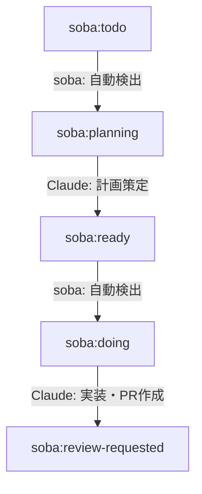

# soba 自動ワークフロー

## 概要

sobaは、GitHub Issueを起点とした自律的な開発ワークフローを実現します。Issue のラベルに基づいて自動的に計画と実装のサイクルを実行します。

## ワークフローの流れ

## 計画フェーズ

### 1. Issue検出
- **対象ラベル**: `soba:todo`
- **検出方法**: 定期的なGitHub Issue監視
- **選定基準**: Issue番号が最も若いものを1件抽出
- **実行主体**: **soba CLI**

### 2. 計画策定
- **【soba】** ラベルを `soba:todo` → `soba:planning` に変更
- **【soba】** Claude Codeプロセスを起動
- **【Claude】** Issueの内容を分析し、実装計画を策定
- **【Claude】** 策定完了後、ラベルを `soba:planning` → `soba:ready` に変更

## 実装フェーズ

### 1. Issue検出
- **対象ラベル**: `soba:ready`
- **検出方法**: 定期的なGitHub Issue監視
- **選定基準**: Issue番号が最も若いものを1件抽出
- **実行主体**: **soba CLI**

### 2. 実装作業
- **【soba】** ラベルを `soba:ready` → `soba:doing` に変更
- **【soba】** Claude Codeプロセスを起動
- **【Claude】** 以下を自動実行：
  - Issueの実装
  - セルフレビュー
  - Pull Request作成
- **【Claude】** 完了後、ラベルを `soba:doing` → `soba:review-requested` に変更

## ラベル定義

| ラベル | 状態 | 説明 | 変更主体 |
|--------|------|------|----------|
| `soba:todo` | 待機 | 新規Issue、計画待ち | - |
| `soba:planning` | 計画中 | Claude Codeが計画策定中 | soba → |
| `soba:ready` | 準備完了 | 計画策定済み、実装待ち | Claude → |
| `soba:doing` | 実装中 | Claude Codeが実装作業中 | soba → |
| `soba:review-requested` | レビュー待ち | PR作成済み、レビュー待ち | Claude → |

## 自動化のメリット

1. **継続的な進捗**: Issueが自動的に処理され、開発が停滞しない
2. **一貫性**: 同じプロセスで全てのIssueを処理
3. **効率化**: 手動でのラベル変更やプロセス起動が不要
4. **優先順位管理**: Issue番号順による明確な処理順序
